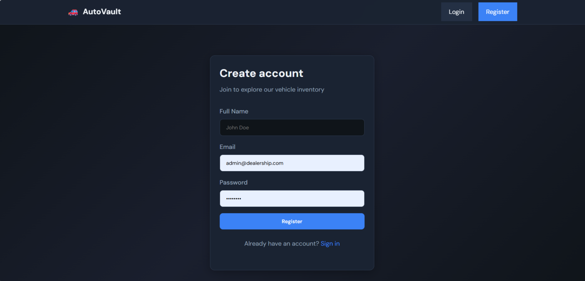
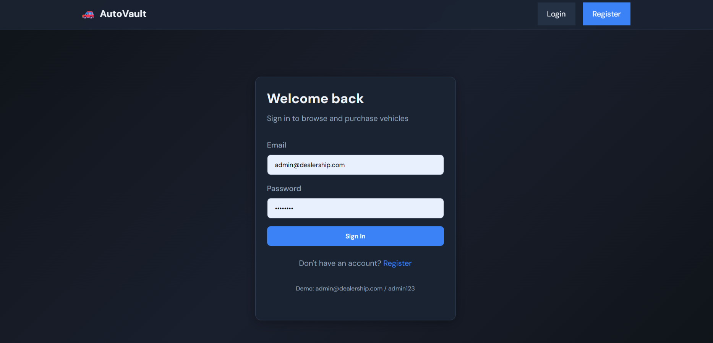
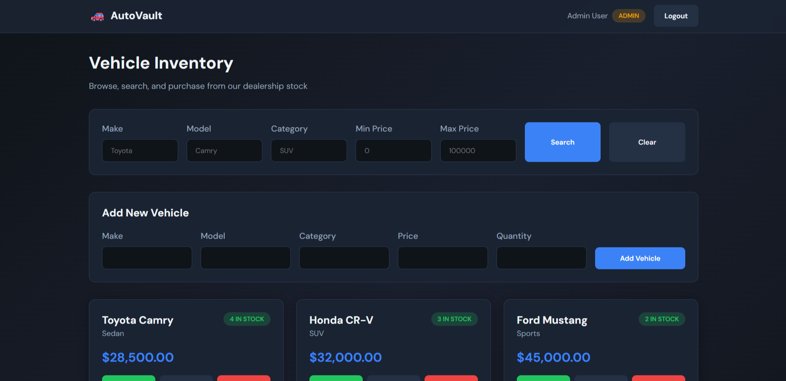
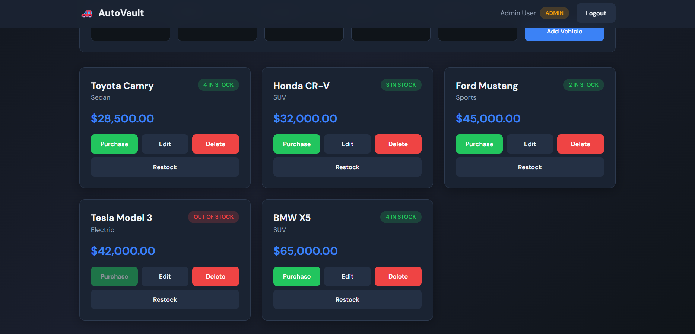
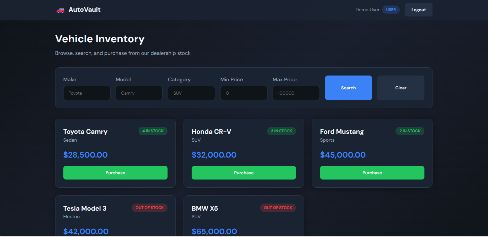

# Car Dealership Inventory System

A full-stack car dealership inventory management application built with **Java Spring Boot**, **React**, and **MySQL**. Users can register, log in, browse vehicles, search/filter inventory, and purchase cars. Admin users can add, update, delete, and restock vehicles.

## Tech Stack

| Layer    | Technology                          |
|----------|-------------------------------------|
| Backend  | Java 17, Spring Boot 3, Spring Security, JWT |
| Frontend | React 18, Vite, React Router        |
| Database | MySQL 8                             |

## Features

- JWT-based user registration and login
- Protected REST API endpoints
- Vehicle CRUD operations
- Search by make, model, category, and price range
- Purchase vehicles (decreases stock)
- Admin-only delete and restock
- Responsive React dashboard

## Screenshots

### Login Page



### Register Page



### Dashboard





### User dashboard



## API Endpoints

| Method | Endpoint                      | Auth     | Description              |
|--------|-------------------------------|----------|--------------------------|
| POST   | `/api/auth/register`          | Public   | Register new user        |
| POST   | `/api/auth/login`             | Public   | Login and get JWT        |
| GET    | `/api/vehicles`               | Protected| List all vehicles        |
| GET    | `/api/vehicles/search`        | Protected| Search/filter vehicles   |
| POST   | `/api/vehicles`               | Protected| Add vehicle              |
| PUT    | `/api/vehicles/:id`           | Protected| Update vehicle           |
| DELETE | `/api/vehicles/:id`           | Admin    | Delete vehicle           |
| POST   | `/api/vehicles/:id/purchase`  | Protected| Purchase vehicle         |
| POST   | `/api/vehicles/:id/restock`   | Admin    | Restock vehicle          |

## Prerequisites

- Java 17+
- Node.js 18+
- MySQL 8+

## Setup Instructions

### 1. Database

Start MySQL and create the database (optional — Spring Boot can auto-create):

```bash
mysql -u root -p < database/schema.sql
```

Update credentials in `backend/src/main/resources/application.properties` if needed:

```properties
spring.datasource.username=root
spring.datasource.password=root
```

### 2. Backend

```bash
cd backend
./mvnw spring-boot:run
```

On Windows:

```bash
cd backend
mvnw.cmd spring-boot:run
```

Backend runs at **http://localhost:8080**

### 3. Frontend

```bash
cd frontend
npm install
npm run dev
```

Frontend runs at **http://localhost:5173**

## Demo Accounts

| Role  | Email                  | Password  |
|-------|------------------------|-----------|
| Admin | admin@dealership.com   | admin123  |
| User  | user@dealership.com    | user123   |

## Running Tests

```bash
cd backend
mvnw.cmd test
```

Tests use an in-memory H2 database. A test report is generated at `backend/target/surefire-reports/`.

## Project Structure

```
Incubyte/
├── backend/          # Spring Boot REST API
├── frontend/         # React SPA
├── database/         # MySQL schema
└── README.md
```

## My AI Usage

### Tools Used

- **Cursor AI (Claude)** — Primary development assistant for this project

### How AI Was Used

- Generated the initial Spring Boot project structure (entities, repositories, services, controllers)
- Implemented JWT authentication and Spring Security configuration
- Created React components, routing, and API integration layer
- Wrote unit and integration tests for backend services
- Drafted this README with setup instructions

### Reflection

AI significantly accelerated boilerplate generation and helped maintain consistency across the full stack. I reviewed all generated code, adapted it to the PDF requirements, and ensured proper separation of concerns (DTOs, services, security layer). The TDD approach was applied to core business logic (purchase, restock, auth) with meaningful test cases.

---

Built for the Incubyte TDD Kata: Car Dealership Inventory System.
